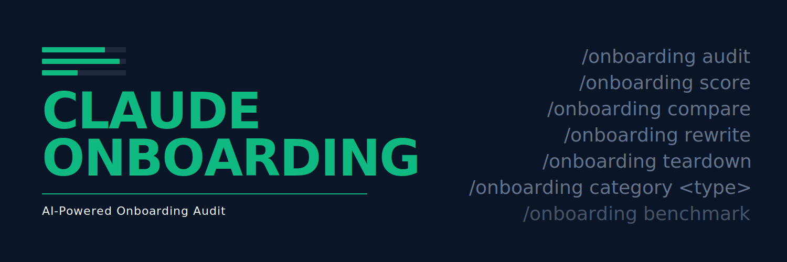

<p align="center">
  
</p>

# claude-onboarding

> Audit any SaaS onboarding flow in 5 minutes. Get a scored report and a prioritized roadmap.

```
$ claude-onboarding audit https://your-saas.com

Onboarding Audit — your-saas.com
─────────────────────────────────────────────

  Score  78 / 100        Top 15% in B2B SaaS

  Signup form         ▓▓▓▓▓▓▓▓░░    82
  Email verification  ▓▓▓▓▓▓▓▓▓░    91
  First screen        ▓▓▓▓▓▓▓░░░    74
  Empty states        ▓▓▓▓▓▓▓▓▓▓    98
  Activation surface  ▓▓▓▓▓▓░░░░    68

  Top friction points
    1. Activation event hidden 4 clicks deep
    2. Forced workspace name before first action
    3. No "skip" affordance on team invite

  → audit-report-2026-04-30.md
```

*v1.0 ships June 2026.*

## What it does

`claude-onboarding` is a [Claude Code](https://claude.com/claude-code) skill that:

1. Takes a SaaS signup URL (and optional test credentials)
2. Navigates the onboarding flow autonomously — signup, email verification, post-signup screen, empty states, activation surface
3. Audits 60+ measurable signals across 11 categories
4. Compares findings to industry benchmarks segmented by SaaS category
5. Outputs a scored report with prioritized recommendations and citations

It mirrors what consultants like ProductLed sell as $2,000–$5,000 5-day audit sprints — in five minutes, reproducible across as many flows as you want to study.

## What it audits

11 categories. 60+ measurable signals.

- **Signup form** — field count, social auth, validation, password UX, GDPR friction
- **Email verification** — magic link vs code, latency, soft vs hard wall
- **First screen post-signup** — primary CTA, progress indicator, time-to-orientation
- **Empty states** — copy, sample seeding, "do this first" CTAs
- **Contextual help** — tooltips, inline vs modal, video embeds
- **Personalization** — role/use-case selectors, downstream branching
- **Activation event surfacing** — proximity, prominence, time-to-first-value
- **Friction & anti-patterns** — forced invites, early upsell, mandatory phone
- **Mobile responsiveness** — viewport handling, tap targets, font sizing
- **Accessibility** — WCAG 2.2 basics
- **Performance** — LCP, TTI, payload size

## Methodology

Grounded in canonical onboarding literature:

- Wes Bush — *Product-Led Onboarding* (ARC framework, value gap)
- Ramli John — *Product-Led Onboarding* (EUREKA, MVO)
- Krystal Higgins — *Better Onboarding* (onboarding surface area)
- Bob Moesta — *Demand-Side Sales 101* (Forces of Progress)
- BJ Fogg — *Tiny Habits* (B = MAP)
- Nir Eyal — *Hooked* (the four-step loop)
- Kathy Sierra — *Badass: Making Users Awesome*
- Reforge — activation = behavior that predicts retention

Full bibliography → [awesome-saas-onboarding](https://github.com/lusknchars/awesome-saas-onboarding).

## Author

Built by [Lucas Oliveira](https://github.com/lusknchars).

## License

[MIT](LICENSE)
